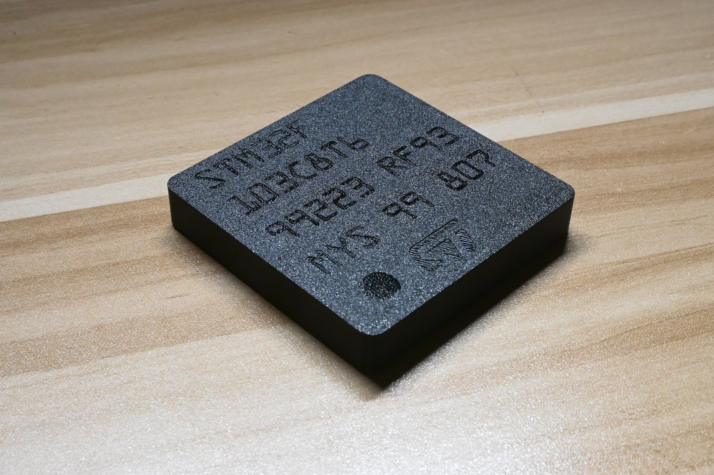
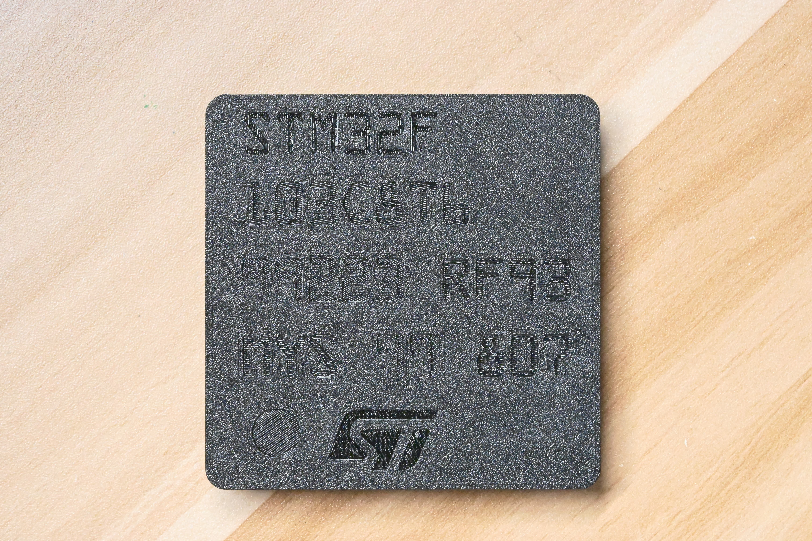
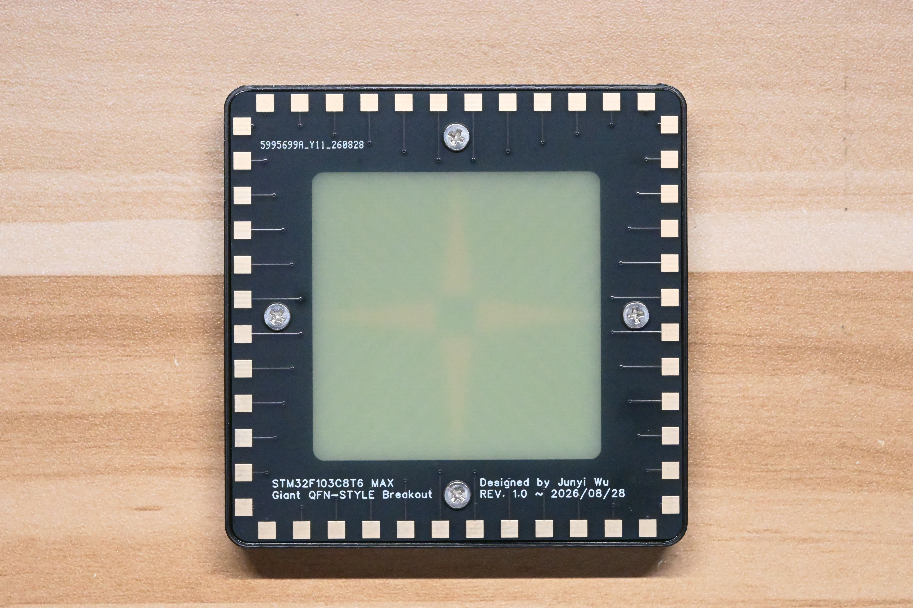
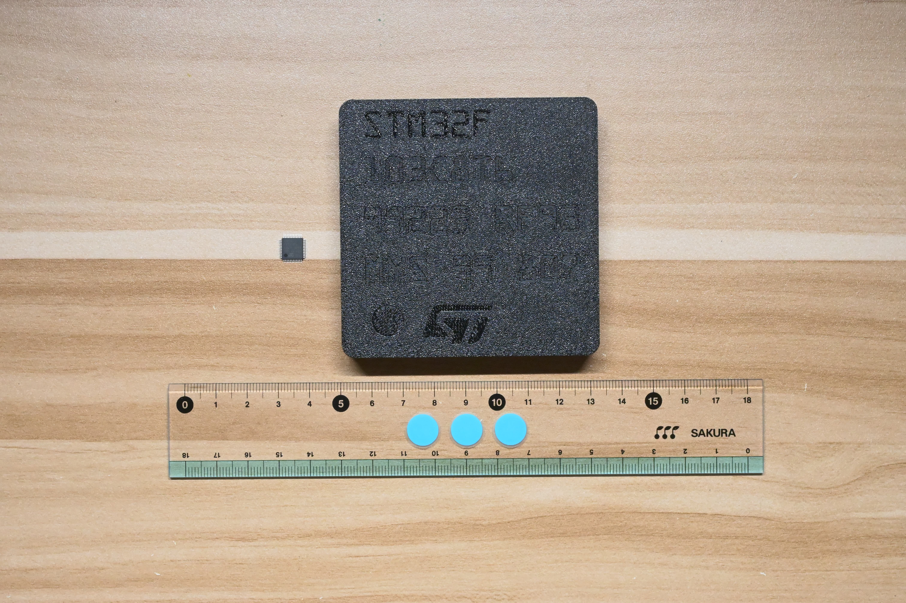
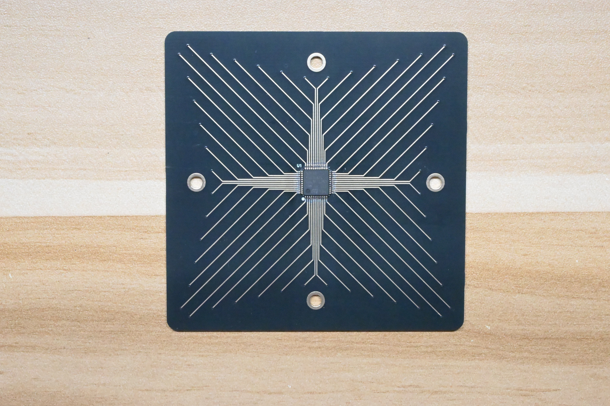
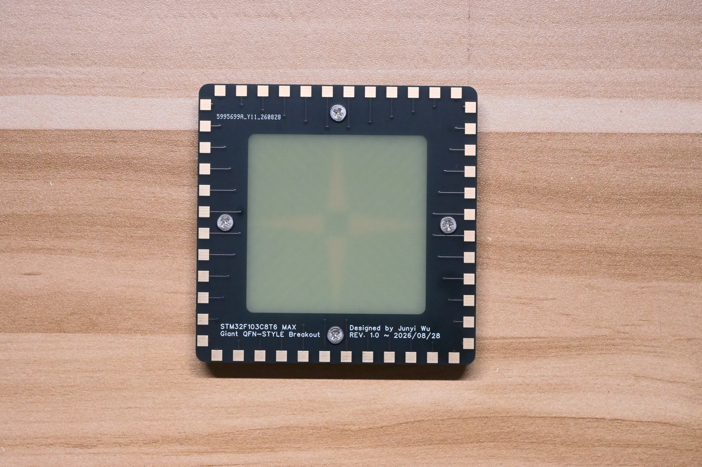
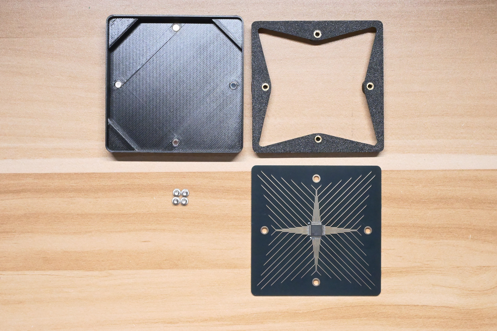
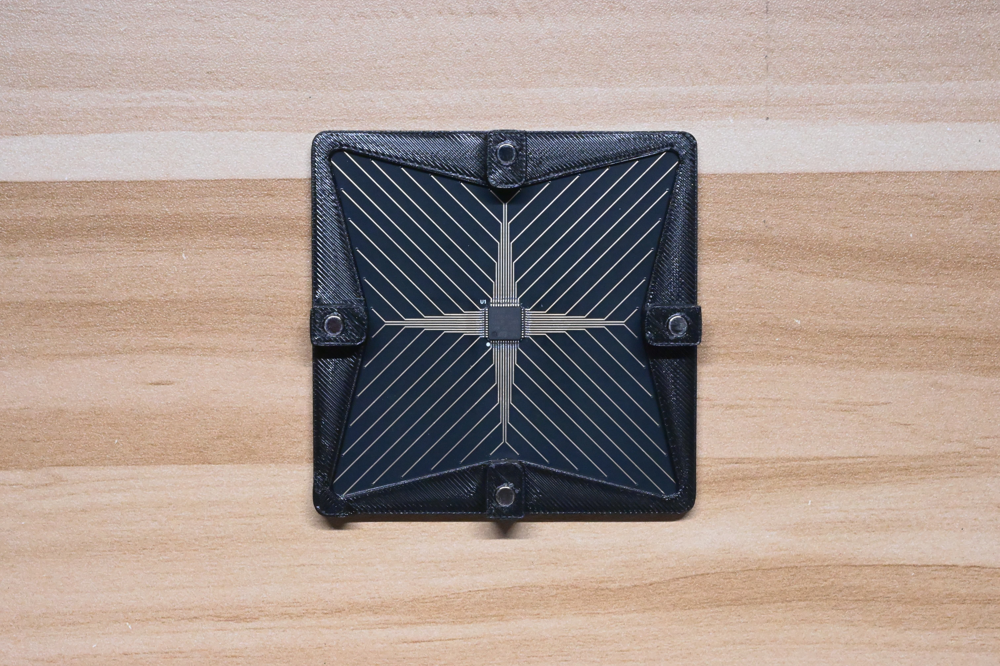
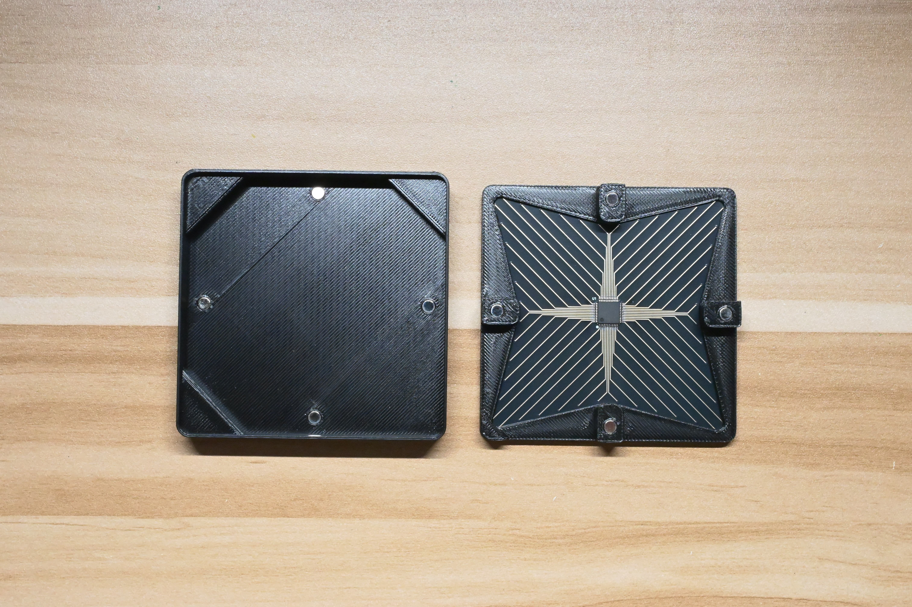
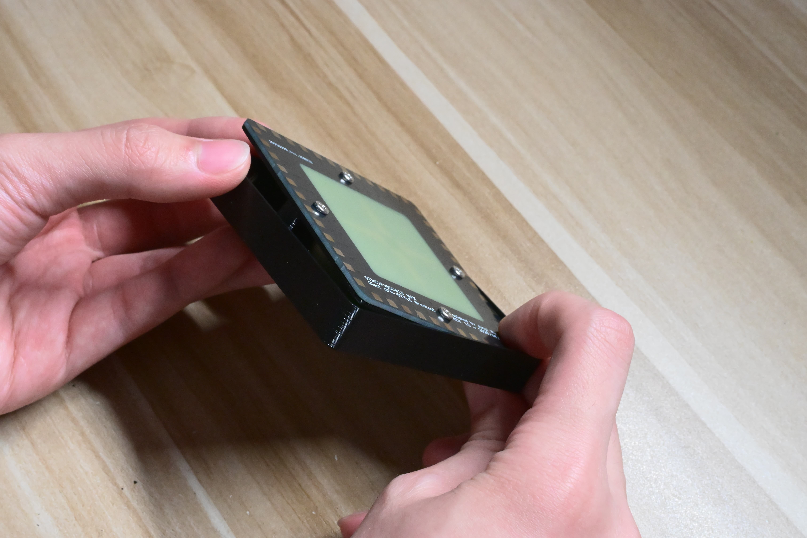

# Giant STM32 Package

A ridiculously oversized STM32F103C8T6 package with 1:1 pin mapping and a 3D-printed enclosure.

## What is this?

This is a deliberately oversized STM32F103C8T6 package built mostly for fun.

At the center is a real **STM32F103C8T6** in its original **LQFP48** package. A custom PCB maps all 48 physical pins 1:1 to oversized pads around the edge, turning the original chip into a giant **QFN-style 48-pin package**.

The exposed ENIG traces on the PCB are designed to visually resemble the lead-frame / bond-wire structure inside an IC package. Since every pin is actually connected to its corresponding outer pad, this is not just a display model — electrically, it can still function as a giant breakout.

  
  

## Scale

The PCB measures **78 × 78 mm**, while the completed enclosure measures approximately **80.5 × 80.5 × 12.7 mm**.

For comparison, the photo below shows the giant package next to a normal LQFP48 STM32F103C8T6.

## PCB Design

The PCB is a 2-layer FR-4 board with exposed ENIG traces on the top side.

The 48 STM32 pins fan out symmetrically from the center and are routed to the oversized pads around the edge of the board. The layout was designed mainly for appearance rather than minimum trace length.

  
  

The PCB specifications used for the fabricated version are:

- 78 × 78 mm
- 2-layer FR-4
- 1.6 mm thickness
- 1 oz copper
- ENIG surface finish

Four M3 mounting holes are used to secure the PCB to the internal frame.

## Enclosure

The enclosure consists of two 3D-printed PETG parts:

- a **top cover**
- an internal **PCB frame**

Black PETG was chosen to resemble the molded black body of a real IC package.

The PCB is attached to the frame using four M3 × 4 mm low-profile Phillips screws and four brass heat-set inserts.

Eight N52 neodymium magnets are used to hold the enclosure together. The magnets are Ø4 × 2 mm and are press-fit into slightly undersized holes, so no glue is required.

The complete assembly can be opened to reveal the real STM32 and the exposed routing inside.

## Opening the Enclosure

The magnets are quite strong, and the fit between the PCB assembly and the top cover is intentionally tight.

To open the enclosure:

1. Locate the **Pin 1 marker** — the small dot on the STM32.
2. Flip the package over so that the PCB side is facing upward.
3. Press the PCB near the corner corresponding to the Pin 1 marker.
4. At the same time, gently flex the opposite side of the top cover downward.
5. Once the PCB lifts slightly, separate the PCB assembly from the cover.

Only a small amount of flex is needed. Do not force the enclosure apart.

## Gerber Variants

Two Gerber sets are included.

### `fabricated-no-center-pad.zip`

This is the version that was actually manufactured and assembled.

The original STM32F103C8T6 in LQFP48 does **not** have a center exposed pad. A large center pad is therefore not required electrically.

For the fabricated version, the large QFN-style center area has a solder-mask opening but **no copper underneath it**.

I chose this version because I was concerned that such a large exposed copper area could trigger additional fabrication review, particularly with ENIG.

This does **not** mean that the center-pad version is inherently unmanufacturable.

### `untested-center-pad.zip`

This alternative version includes a large copper center pad to make the bottom side look more like a real QFN package.

The center pad is purely decorative and has no electrical function in this design.

This version has **not been fabricated or verified**.

The two Gerber files are available in [`hardware/gerber/`](hardware/gerber/):

- [`fabricated-no-center-pad.zip`](hardware/gerber/fabricated-no-center-pad.zip) — the version actually fabricated
- [`untested-center-pad.zip`](hardware/gerber/untested-center-pad.zip) — decorative center-pad variant, not fabricated

## 3D Printing

Mechanical files are provided in three formats:

- **STEP** — for editing or modifying the geometry
- **STL** — for general-purpose slicing
- **3MF** — prepared print projects

The included 3MF files were prepared in **Bambu Studio** for **PETG on a Bambu Lab X1C**.

The print settings are mostly based on the default PETG profile, with minor support adjustments to make support removal easier.

They should be treated as a convenient starting point rather than a universal print profile.

STEP, STL, and 3MF files are available in the [`mechanical/`](mechanical/) directory.

## Bill of Materials

A complete bill of materials is available in [`BOM.csv`](BOM.csv).

The main components are:

| Component | Specification | Quantity |
| --- | --- | ---: |
| Microcontroller | STM32F103C8T6, LQFP48 | 1 |
| PCB | 78 × 78 mm, 2-layer FR-4, 1.6 mm, 1 oz, ENIG | 1 |
| Magnets | N52 neodymium, Ø4 × 2 mm | 8 |
| Screws | M3 × 4 mm, low-profile Phillips, 304 stainless steel | 4 |
| Heat-set inserts | Brass, M3, 3 mm height, Ø4.2 mm outer diameter | 4 |
| Top cover | Black PETG | 1 |
| PCB frame | Black PETG | 1 |

## Schematic

The electrical design is intentionally simple: all 48 physical STM32 pins are mapped 1:1 to the corresponding oversized outer pads.

See the full [`schematic.pdf`](hardware/schematic/schematic.pdf) for the complete pin mapping.

## License

This project is released under the [MIT License](LICENSE).
